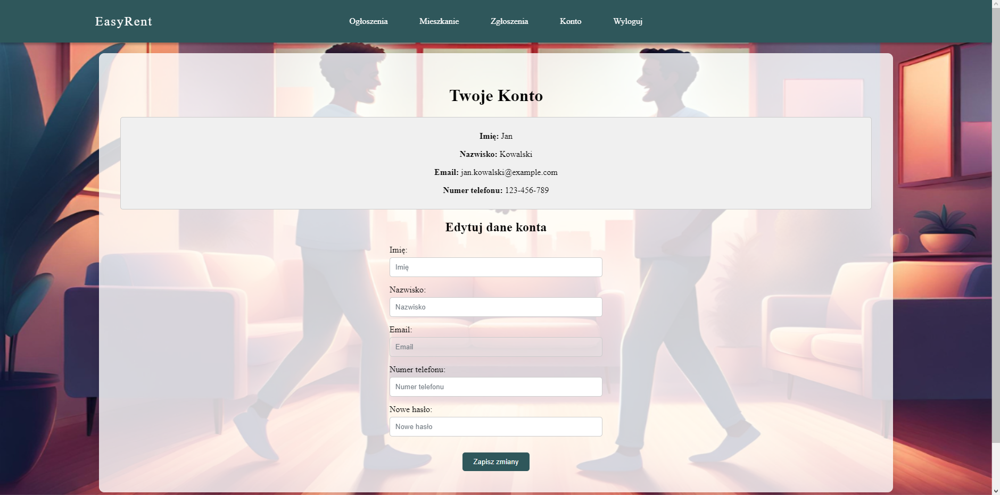

# EasyRent FrontEnd Documentation

## 1. GitHub Repository
- Repository Link: [EasyRent FrontEnd](https://github.com/sdarek/easyrent)
- Repository Link: [EasyRent BackEnd](https://github.com/ZakharSytoi/EasyRentApplication)
## 2. Starting up the Application
**Prerequisites:**
- Angular 16
- NodeJS
- npm
- Docker

**Steps:**
1. **Clone the repository:**  
```git clone https://github.com/sdarek/easyrent.git```
2. **Navigate to the directory:**  
```cd easyrent/```
3. **Build docker file:**  
```docker-compose build```
4. **Start docker file:**  
```docker-compose up```  
This will open the app in the browser at http://localhost:8080/.  

## 3. Main Directories and Their Functions
- **src/index.html:** Main HTML document with head and redirects to the app.
- **src/app/app.module.ts:** Contains all modules used in HTML/CSS.
- **src/app/app.routing.module.ts:** Configuration of routing.
- **src/app/components:** Contains views; modify HTML/CSS here.
- **src/app/guards:** Auto-generated directory by Angular.
- **src/app/interface:** Declares user interfaces.
- **src/app/services:** Contains all services.
- **src/app/shared/password-match.directive.ts:** Ensures matching passwords in the registration form.

**Note:** Other files/directories are automatically generated by Angular.

## 4. Authors
- **Maksymilian Shestalyuk**
- **Darek Surdel**
- **Truong Tra My**
- **Zakhar Sytoi** [BackEnd Developer]

## 5. Screenshots
1. **Main Page**


2. **Account Information and Edit**


3. **Adding Apartment**


4. **Welcome Dashboard**


5. **Apartment Details and Tenant Management**


6. **Contract Details and Tenant List**


7. **First Steps Info**


8. **Login Form**


9. **Registration Form**


10. **Reports in Owner's Panel**
 

11. **Tenant's Apartment Information**
 

12. **Tenant Apartment Details**
 